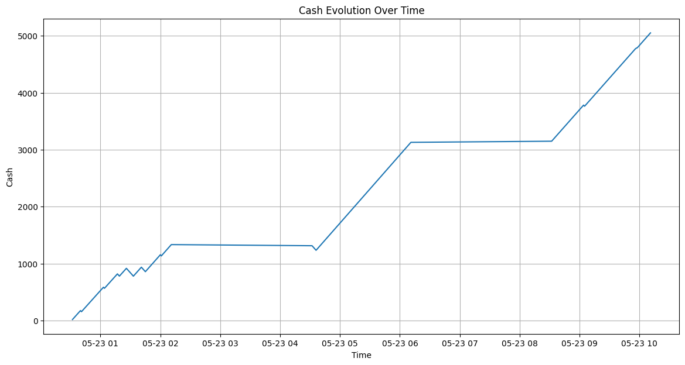

# Driftoor Bot
Market Making bot for Drift Labs

Market Making bot built for the Drift Decentralized Exchange. 

The bot posts a number of symmetrical orders around the mid, manages inventory and applies a Kalman Filter normalized error strategy.

## Strategy Overview

1. Initialize run variables at the beggining of the main function.

2. We calculate the midprice based on a weighted DLOB which ponders the volume available, skewing the mid down if the ask side is heavy and viceversa.

3. We fetch our current position and When we surpass the leverage limit we try to aggressively close our exposure placing orders TOB(Top of Book).

4. Check if current mid has changed more than a threshold before continuing so that we don't repost too often and don't lose or queue.

5. Calculate the normalized error of the current close vs. the Kalman Filter, we use this to apply a skew to the mid price and thus increasing our odds of getting strategic fills.

## Setup

1. Please use Python 3.10.11 and remember to pip install -r requirements.txt

2. Add your Anchor Wallet private key to .env on the root folder as follows: 
```
ANCHOR_WALLET=C:/Users/...
```

3. You can play with the strategy parameters located at the beginning of the main function.

4. Run the main.py file.

## Others

* dlob.py fetches DLOB snapshots and computes a weighted midprice based on a volume_threshold amount of liquidity starting from TOB. 

* strategy.py computes the mentioned strategy.

* backtest.ipynb simple backtest of the market making strategy.



Thank you very much team for the opportunity!